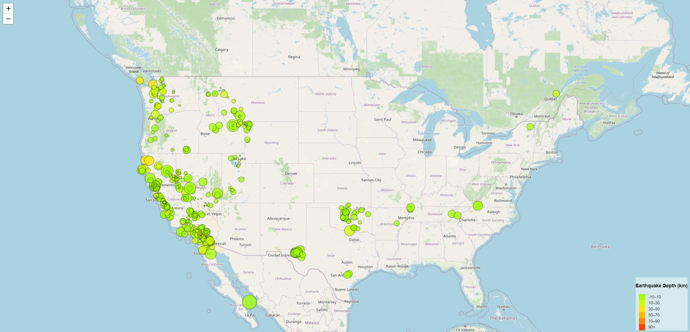
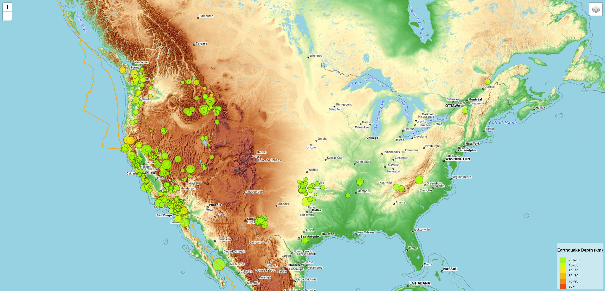

# leaflet-challenge
Module #15 - Leaflet Challenge

## Background

The United States Geological Survey, or USGS for short, is responsible for providing scientific data about natural hazards, the health of our ecosystems and environment, and the impacts of climate and land-use change. Their scientists develop new methods and tools to supply timely, relevant, and useful information about the Earth and its processes.

The USGS is interested in building a new set of tools that will allow them to visualize their earthquake data. They collect a massive amount of data from all over the world each day, but they lack a meaningful way of displaying it. In this challenge, you have been tasked with developing a way to visualize USGS data that will allow them to better educate the public and other government organizations (and hopefully secure more funding) on issues facing our planet.

## Instructions

The instructions for this activity are broken into two parts:

### Part 1: Create the Earthquake Visualization
   1. Get your dataset. To do so, follow these steps:
        - The USGS provides earthquake data in a number of different formats, updated every 5 minutes. Visit the USGS GeoJSON page (http://earthquake.usgs.gov/earthquakes/feed/v1.0/geojson.php)  and choose a dataset to visualize. 
        - When you click a dataset (such as "All Earthquakes from the Past 7 Days"), you will be given a JSON representation of that data. Use the URL of this JSON to pull in the data for the visualization. 

   2. Import and visualize the data by doing the following:
        - Using Leaflet, create a map that plots all the earthquakes from your dataset based on their longitude and latitude.
        - Your data markers should reflect the magnitude of the earthquake by their size and the depth of the earthquake by color. Earthquakes with higher magnitudes should appear larger, and     earthquakes with greater depth should appear darker in color. (HINT: The depth of the earth can be found as the third coordinate for each earthquake)
        - Include popups that provide additional information about the earthquake when a marker is clicked.
        - Create a legend that will provide context for your map data.

   3. The final visualization will look something like the map below. The data markers reflect the magnitude of the earthquake with their size and the depth represents their color. Earthquakes with higher magnitudes are larger in size, and earthquakes with greater depth appear darker in color.

 #### Earthquake Map with Legend

### Part 2: Gather and plot more data
   1. Plot a second data set on your map: 
        - To illustrate the relationship between tectonic plates and seismic activity. Data on tectonic plates can be found at (https://github.com/fraxen/tectonicplates) .

   2. Perform the following:
        - Plot the tectonic plates dataset on the map in addition to the earthquakes.
        - Add other base maps to choose from
        - Put each dataset into a separate layer so that they can be controlled independently.
        - Add layer controls to the map.
 
   3. The final visualization will look something like the map below. The data markers reflect the magnitude of the earthquake with their size and the depth represents their color. Earthquakes with higher magnitudes are larger in size, and earthquake with greater depth appear darker in color. This version of the map also displays the tectonic plates, and has added layer controls for the different map layers.

 #### Earthquake Map with Tectonic Plates + Layer Controls

### Tectonic Plates Data Source

Tectonics Plate data is made available under the Open Data Commons Attribution License: http://opendatacommons.org/licenses/by/1.0/, please refer to LICENSE.md for more information. Please consider giving Hugo Ahlenius, Nordpil and Peter Bird credit and recognition as a data source.